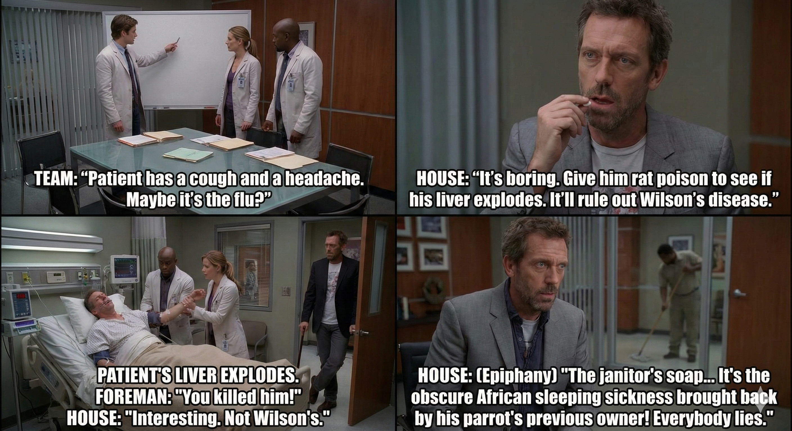

## Ranking & Review

### Relevancy:
This four panel meme is fairly accurate with how an average episode proceeds. House's team is trying to diagnose the patient, and House gives them an unethical treatment to provide. Naturally, the patient does not respond well to the trial, but then House has an epiphany and realizes what is actually wrong with the patient. 

### AI Accuracy:
Gemini generated human faces accurately. Text flows smoothly and nothing repeats. 

### Personal Thoughts:
This meme felt like an ode to how an average episode of House goes. I did not find it very humorous, but I did find the meme to be curated well. I appreciate how Gemini included House's dry humor and oddball experiments. 

### Overall Rating: 6/10
